# AI-OS Architecture: Current vs Target (NS1/NS2)

## Visual Overview

```
┌─────────────────────────────────────────────────────────────────────────────┐
│                        AI-OS ARCHITECTURE MAP                               │
│                    Current State vs NS1/NS2 Vision                          │
└─────────────────────────────────────────────────────────────────────────────┘

┌──────────────────────────────────────────────────────────────────────────────┐
│ LAYER 6: INTERFACE LAYER (Взаимодействие)                                   │
├──────────────────────────────────────────────────────────────────────────────┤
│                                                                               │
│  CURRENT:                               TARGET (NS1/NS2):                    │
│  ✅ Dashboard v2 (React)                ✅ Dashboard v2 (React)             │
│  ✅ Telegram Bot                        ✅ Telegram Bot                      │
│  ✅ FastAPI                             ✅ Voice Interface (TTS/STT)          │
│  ✅ API                                🔄 3D Avatar (ReadyPlayerMe)         │
│                                        🔄 AR/VR Interface                   │
│                                        🔄 Neural Interface                  │
│                                                                               │
│  Progress: ██████████░░░░░░░░ 50%                                              │
└──────────────────────────────────────────────────────────────────────────────┘
                                                  ↕
┌──────────────────────────────────────────────────────────────────────────────┐
│ LAYER 5: GROWTH LAYER (Развитие и эволюция)                                  │
├──────────────────────────────────────────────────────────────────────────────┤
│                                                                               │
│  CURRENT:                               TARGET (NS1/NS2):                    │
│  ❌ (not implemented)                    🌱 Personal Development Engine       │
│                                        🧠 Meta-Learning Core                 │
│                                        🔄 Evolution of Consciousness         │
│                                        📚 Wisdom Integrator                  │
│                                        🤝 Co-Evolution System                │
│                                                                               │
│  Progress: ██░░░░░░░░░░░░░░░░░░ 10%                                              │
│  _gap_: Полностью отсутствует слой развития                                   │
└──────────────────────────────────────────────────────────────────────────────┘
                                                  ↕
┌──────────────────────────────────────────────────────────────────────────────┐
│ LAYER 4: BEHAVIORAL LAYER (Поведенческий уровень)                            │
├──────────────────────────────────────────────────────────────────────────────┤
│                                                                               │
│  CURRENT:                               TARGET (NS1/NS2):                    │
│  ✅ Task Manager (goal_executor)        ✅ Task Manager                       │
│  ✅ Action Sequencer (Agent Graph)      ✅ Action Sequencer                   │
│  🔄 Context Controller (partial)        ✅ Context Controller                 │
│  ✅ Feedback Integrator (evaluator)     ✅ Feedback Integrator                │
│  ✅ User Interaction (Dashboard/Telegram) ✅ User Interaction                  │
│                                                                               │
│  Agent System (11 agents):                                                 │
│  ✅ Supervisor, Coder, PM, Researcher                                      │
│  ✅ Designer, Intelligence, Coach                                         │
│  ✅ Innovator, Librarian, DevOps                                          │
│  ✅ ACTOR, Troubleshooter                                                 │
│                                                                               │
│  Progress: ████████████████░░░░░░ 70%                                           │
└──────────────────────────────────────────────────────────────────────────────┘
                                                  ↕
┌──────────────────────────────────────────────────────────────────────────────┐
│ LAYER 3: EMOTIONAL LAYER (Эмоциональный интеллект)                           │
├──────────────────────────────────────────────────────────────────────────────┤
│                                                                               │
│  CURRENT:                               TARGET (NS1/NS2):                    │
│  ❌ (not implemented)                    💫 Emotion Recognition                │
│                                        💭 Emotion Simulation                  │
│                                        😌 Emotion Regulation                  │
│                                        🔄 Motivation Engine (partial)         │
│                                        💾 Affective Memory                    │
│                                                                               │
│  Progress: ░░░░░░░░░░░░░░░░░░░░  5%                                              │
│  _gap_: Полностью отсутствует эмоциональный слой                              │
└──────────────────────────────────────────────────────────────────────────────┘
                                                  ↕
┌──────────────────────────────────────────────────────────────────────────────┐
│ LAYER 2: COGNITIVE LAYER (Когнитивный уровень)                               │
├──────────────────────────────────────────────────────────────────────────────┤
│                                                                               │
│  CURRENT:                               TARGET (NS1/NS2):                    │
│  ❌ Perception Hub                      👂 Perception Hub                     │
│  🔄 Context Understanding (partial)     🧠 Context Understanding              │
│  ✅ Knowledge Integration (Neo4j+Milvus) 🧩 Knowledge Integration             │
│  ✅ Reasoning Engine (LLM-based)        🔍 Reasoning Engine                   │
│  ❌ Learning Core                      🧬 Learning Core                      │
│  ❌ Predictive Modeler                 🔮 Predictive Modeler                 │
│                                                                               │
│  Memory Architecture:                                                       │
│  ✅ PostgreSQL (goals, artifacts)        ✅ PostgreSQL                         │
│  ✅ Neo4j (graph DB)                    ✅ Neo4j                              │
│  ✅ Milvus (vector DB)                  ✅ Milvus                             │
│  ✅ MinIO (object storage)              ✅ MinIO                              │
│  ✅ Semantic Memory                     ✅ Episodic Memory                    │
│  ❌ Affective Memory                    ✅ Affective Memory                    │
│                                                                               │
│  Progress: ███░░░░░░░░░░░░░░░░░ 30%                                              │
└──────────────────────────────────────────────────────────────────────────────┘
                                                  ↕
┌──────────────────────────────────────────────────────────────────────────────┐
│ LAYER 1: CORE LAYER (Ядро сознания)                                          │
├──────────────────────────────────────────────────────────────────────────────┤
│                                                                               │
│  CURRENT:                               TARGET (NS1/NS2):                    │
│  ━━━━━━━━━━━━━━━━━━━━━━━━━━━━━━━━━━━━━━━━━━━━━━━━━━━━━━━━━━━━━━━━━━━━━━━━━━ │
│  ❌ Personality Engine                 🧩 Personality Engine                 │
│     - No user profile                    - UserProfile (traits, values)       │
│     - No value matrix                    - Value Matrix                       │
│     - No adaptation                      - Behavioral Style                   │
│                                          - Adaptation Loop                   │
│  ━━━━━━━━━━━━━━━━━━━━━━━━━━━━━━━━━━━━━━━━━━━━━━━━━━━━━━━━━━━━━━━━━━━━━━━━━━ │
│  ✅ Goal System v3.0                   🎯 Goal System                        │
│     - Hierarchical (L0-L3)                - JSON-LD formal language            │
│     - 5 goal types                       - Conflict resolution                │
│     - Goal Contracts                     - Motivation Engine                  │
│     - Decomposition                      - Goal Memory                        │
│     - Strict Evaluator                   - Progress Tracking                  │
│     - Reflector                          - Goal Extraction                    │
│     - Semantic Memory                    - Goal Linking                      │
│  ━━━━━━━━━━━━━━━━━━━━━━━━━━━━━━━━━━━━━━━━━━━━━━━━━━━━━━━━━━━━━━━━━━━━━━━━━━ │
│  🔄 Decision Logic (partial)           🧮 Decision Logic                     │
│     - Supervisor routing                 - Context Analyzer                  │
│     - Model differentiation              - Option Generator                  │
│     - Safety breaks                      - Evaluator (multi-dimensional)      │
│                                          - Ethical Filter                    │
│                                          - Adaptive Selector                 │
│                                          - Meta-Decision Module              │
│                                          - XAI (explainability)              │
│  ━━━━━━━━━━━━━━━━━━━━━━━━━━━━━━━━━━━━━━━━━━━━━━━━━━━━━━━━━━━━━━━━━━━━━━━━━━ │
│  🔄 Self-Reflective Model (partial)    🪞 Self-Reflective Model              │
│     - Basic reflection (goal_reflector)   - Experience Tracker                │
│     - Causal analysis                    - Meta-Cognition Engine              │
│                                          - Emotional Mirror                  │
│                                          - Bias Detector                     │
│                                          - Growth Planner                    │
│                                          - Self-Narrative Composer           │
│  ━━━━━━━━━━━━━━━━━━━━━━━━━━━━━━━━━━━━━━━━━━━━━━━━━━━━━━━━━━━━━━━━━━━━━━━━━━ │
│                                                                               │
│  Progress: ████████░░░░░░░░░░░░░ 60%                                             │
└──────────────────────────────────────────────────────────────────────────────┘

┌──────────────────────────────────────────────────────────────────────────────┐
│                        CROSS-LAYER INTEGRATION                               │
├──────────────────────────────────────────────────────────────────────────────┤
│                                                                               │
│  Opencode Integration:                                                       │
│  ✅ File system operations (services/opencode)                               │
│  ✅ Code execution                                                          │
│  ✅ Skills/Plugins system                                                    │
│  ❌ Prompt generation from context                                           │
│  ❌ Behavioral ↔ Opencode feedback loop                                      │
│                                                                               │
│  LLM Integration:                                                            │
│  ✅ Multi-model support (qwen3-coder, gpt-oss, deepseek)                     │
│  ✅ LiteLLM proxy                                                           │
│  ✅ Role-based model selection                                               │
│  ✅ Fallback system (Groq → Ollama)                                          │
│                                                                               │
│  Data Flow:                                                                  │
│  ✅ Async task queue (Celery + Redis)                                        │
│  ✅ State management (LangGraph + MemorySaver)                               │
│  ✅ API orchestration (FastAPI)                                              │
│                                                                               │
└──────────────────────────────────────────────────────────────────────────────┘

┌──────────────────────────────────────────────────────────────────────────────┐
│                           SUMMARY STATS                                       │
├──────────────────────────────────────────────────────────────────────────────┤
│                                                                               │
│  Layer Completion:                                                           │
│  ━━━━━━━━━━━━━━━━━━━━━━━━━━━━━━━━━━━━━━━━━━━━━━━━━━━━━━━━━━━━━━━━━━━━━━━  │
│  Core Layer:     ████████░░░░░░░░░░░░░ 60%                                   │
│  Cognitive Layer: ███░░░░░░░░░░░░░░░░░░ 30%                                   │
│  Emotional Layer: ░░░░░░░░░░░░░░░░░░░░  5%                                   │
│  Behavioral Layer:███████████░░░░░░░░░ 70%                                   │
│  Growth Layer:   ░░░░░░░░░░░░░░░░░░░░ 10%                                   │
│  Interface Layer:█████████░░░░░░░░░░░░ 50%                                   │
│  ━━━━━━━━━━━━━━━━━━━━━━━━━━━━━━━━━━━━━━━━━━━━━━━━━━━━━━━━━━━━━━━━━━━━━━━  │
│                                                                               │
│  Overall Progress: ~38% (███████████████░░░░░░░░)                           │
│  Target Progress: ~82% (██████████████████░░)                               │
│                                                                               │
│  Critical _gap_s (Phase 1-3 priority):                                       │
│  1. 🔴 Personality Engine (Core Layer)                                       │
│  2. 🔴 Emotional Layer (Layer 3)                                             │
│  3. 🟡 Enhanced Decision Logic (Core Layer)                                  │
│  4. 🟡 Growth Layer (Layer 5)                                                │
│                                                                               │
└──────────────────────────────────────────────────────────────────────────────┘
```

---

## Mermaid Diagram (для рендеринга)

```mermaid
graph TB
    subgraph "Interface Layer"
        DASH[Dashboard v2]
        TGM[Telegram Bot]
        API[FastAPI]
        VOICE[Voice Interface]
        AVATAR[3D Avatar]
    end

    subgraph "Growth Layer"
        PDE[Personal Development Engine]
        ML[Meta-Learning Core]
        EOC[Evolution of Consciousness]
        WI[Wisdom Integrator]
        CES[Co-Evolution System]
    end

    subgraph "Behavioral Layer"
        TM[Task Manager]
        AS[Action Sequencer]
        CC[Context Controller]
        FI[Feedback Integrator]
        UIM[User Interaction Module]
        AGENTS[Agent System<br/>11 agents]
    end

    subgraph "Emotional Layer"
        ER[Emotion Recognition]
        ES[Emotion Simulation]
        EREG[Emotion Regulation]
        ME[Motivation Engine]
        AM[Affective Memory]
    end

    subgraph "Cognitive Layer"
        PH[Perception Hub]
        CU[Context Understanding]
        KIS[Knowledge Integration<br/>Neo4j+Milvus+MinIO]
        RE[Reasoning Engine<br/>LLM-based]
        LC[Learning Core]
        PM[Predictive Modeler]
    end

    subgraph "Core Layer"
        PE[Personality Engine]
        GS[Goal System v3.0]
        DL[Decision Logic]
        SRM[Self-Reflective Model]
    end

    subgraph "External Systems"
        OC[Opencode]
        LLM[LLM Providers<br/>Groq/Ollama]
    end

    %% Connections
    DASH --> API
    TGM --> API
    API --> GS
    API --> AGENTS

    VOICE -.->|Phase 7| API
    AVATAR -.->|Phase 7| DASH

    GS --> TM
    DL --> AS
    SRM --> FI

    PDE -.->|Phase 6| GS
    ML -.->|Phase 6| LC
    EOC -.->|Phase 6| SRM

    ER --> CC
    ES --> AS
    EREG --> DL
    ME --> TM
    AM --> CU

    PH --> CU
    CU --> DL
    KIS --> RE
    RE --> DL
    LC -.->|Phase 5| SRM
    PM -.->|Phase 5| DL

    PE --> GS
    PE --> DL

    AGENTS --> OC
    RE --> LLM

    %% Styling
    classDef implemented fill:#90EE90,stroke:#006400,stroke-width:2px
    classDef partial fill:#FFD700,stroke:#FF8C00,stroke-width:2px
    classDef missing fill:#FFB6C1,stroke:#DC143C,stroke-width:2px
    classDef external fill:#E0E0E0,stroke:#808080,stroke-width:2px

    class DASH,TGM,API,GS,TM,AS,FI,AGENTS,KIS,RE implemented
    class CC,DL,SRM,CU partial
    class PE,ER,ES,EREG,ME,AM,PH,LC,PM,PDE,ML,EOC,WI,CES,VOICE,AVATAR missing
    class OC,LLM external
```



---

## Component Interaction Flow

```
┌─────────────────────────────────────────────────────────────────────────────┐
│                    DECISION FLOW (Target Architecture)                      │
└─────────────────────────────────────────────────────────────────────────────┘

User Input
    ↓
Perception Hub (Cognitive Layer)
    ↓
Context Understanding (Cognitive Layer)
    ↓
Personality Engine (Core Layer) ← Get user profile
    ↓
Goal System (Core Layer) ← Extract/Check goals
    ↓
Decision Logic (Core Layer)
    ├─→ Option Generator (3-5 alternatives)
    ├─→ Evaluator (score by effectiveness/values/risk/emotion)
    ├─→ Ethical Filter (check against Personality Engine values)
    ├─→ Emotional Layer (get emotional context)
    └─→ Adaptive Selector (choose best option)
    ↓
Behavioral Layer
    ├─→ Task Manager (break down into tasks)
    ├─→ Action Sequencer (plan steps)
    ├─→ Context Controller (adapt to current context)
    └─→ Agent System (execute via 11 specialized agents)
    ↓
Opencode / External APIs (actual execution)
    ↓
Feedback Integrator (Behavioral Layer)
    ├─→ Results → Artifact Registry
    ├─→ Emotional state → Emotional Layer
    └─→ Lessons → Self-Reflective Model
    ↓
Self-Reflective Model (Core Layer)
    ├─→ Experience Tracker (log decision)
    ├─→ Meta-Cognition Engine (analyze thinking process)
    ├─→ Emotional Mirror (track emotional patterns)
    ├─→ Bias Detector (identify cognitive biases)
    └─→ Growth Planner (plan AI self-improvement)
    ↓
Growth Layer
    ├─→ Personal Development Engine (analyze user growth)
    ├─→ Meta-Learning Core (improve AI learning)
    └─→ Wisdom Integrator (synthesize wisdom)
    ↓
Personality Engine (Core Layer) ← Adapt based on feedback
    ↓
Interface Layer
    ├─→ Communication Style (from Personality Engine)
    ├─→ Explanation (XAI from Decision Logic)
    └─→ Response (via Dashboard/Telegram/Voice)
```

---

## Current vs Target: Feature Matrix

| Feature | Current | Target | Gap |
|---------|---------|--------|-----|
| **Core Layer** | | | |
| User Profile | ❌ | ✅ UserProfile (Big Five, values, preferences) | Полностью отсутствует |
| Value Matrix | ❌ | ✅ Prioritization by values | Нет |
| Goal Formalism | 🟡 JSON | ✅ JSON-LD | Частично |
| Goal Conflicts | ❌ | ✅ Conflict resolution | Нет |
| Decision Alternatives | ❌ | ✅ Option Generator (3-5 options) | Нет |
| Ethical Filter | ❌ | ✅ Value-based filtering | Нет |
| Decision Explanation | ❌ | ✅ XAI (why this decision?) | Нет |
| Self-Reflection | 🟡 Basic | ✅ Full (Experience Tracker, Meta-Cognition, Bias) | Базовый |
| **Cognitive Layer** | | | |
| Unified Perception | ❌ | ✅ Perception Hub (text+voice+image+biometrics) | Нет |
| Deep Context | 🟡 Last 15 msgs | ✅ Full context (history+emotions+goals) | Поверхностный |
| Continual Learning | ❌ | ✅ Learning Core | Нет |
| Predictions | ❌ | ✅ Predictive Modeler | Нет |
| **Emotional Layer** | | | |
| Emotion Recognition | ❌ | ✅ NLP+tone analysis | Полностью отсутствует |
| Emotion Simulation | ❌ | ✅ AI emotional state | Нет |
| Emotion Regulation | ❌ | ✅ Balance mechanism | Нет |
| Affective Memory | ❌ | ✅ Emotional context storage | Нет |
| **Behavioral Layer** | | | |
| Context Adaptation | 🟡 Safety breaks | ✅ Full context awareness (time/fatigue/mood) | Частично |
| Emotional Behavior | ❌ | ✅ Tone adapts to emotion | Нет |
| **Growth Layer** | | | |
| User Development | ❌ | ✅ Personal Development Engine | Полностью отсутствует |
| AI Self-Learning | ❌ | ✅ Meta-Learning Core | Нет |
| Co-Evolution | ❌ | ✅ Joint evolution system | Нет |
| **Interface Layer** | | | |
| Voice I/O | ❌ | ✅ TTS/STT | Нет |
| 3D Avatar | ❌ | ✅ ReadyPlayerMe/Vroid | Нет |
| Adaptive UI | ❌ | ✅ UI changes by context | Нет |

---

## Implementation Priority Matrix

```
┌─────────────────────────────────────────────────────────────────────────────┐
│                        PRIORITY MATRIX                                      │
├─────────────────────────────────────────────────────────────────────────────┤
│                                                                             │
│  HIGH IMPACT + HIGH FEASIBILITY (Phase 1-2)                               │
│  ━━━━━━━━━━━━━━━━━━━━━━━━━━━━━━━━━━━━━━━━━━━━━━━━━━━━━━━━━━━━━━━━━━━━━━━│
│  ✅ Personality Engine (Core Layer)                                         │
│  ✅ Enhanced Decision Logic (Core Layer)                                   │
│  ✅ Goal-Value Integration                                                  │
│                                                                             │
│  HIGH IMPACT + MEDIUM FEASIBILITY (Phase 3-4)                              │
│  ━━━━━━━━━━━━━━━━━━━━━━━━━━━━━━━━━━━━━━━━━━━━━━━━━━━━━━━━━━━━━━━━━━━━━━━│
│  🔶 Emotional Layer (Emotion Recognition, Simulation)                      │
│  🔶 Enhanced Self-Reflection (Meta-Cognition, Bias Detector)               │
│  🔶 Context Understanding (deep)                                           │
│                                                                             │
│  MEDIUM IMPACT + HIGH FEASIBILITY (Phase 5)                                │
│  ━━━━━━━━━━━━━━━━━━━━━━━━━━━━━━━━━━━━━━━━━━━━━━━━━━━━━━━━━━━━━━━━━━━━━━━│
│  🔷 Learning Core (continual learning)                                     │
│  🔷 Predictive Modeler                                                     │
│  🔷 Perception Hub                                                          │
│                                                                             │
│  HIGH IMPACT + LOW FEASIBILITY (Phase 6)                                   │
│  ━━━━━━━━━━━━━━━━━━━━━━━━━━━━━━━━━━━━━━━━━━━━━━━━━━━━━━━━━━━━━━━━━━━━━━━│
│  🔸 Growth Layer (Personal Development, Meta-Learning)                     │
│  🔸 Wisdom Integrator                                                       │
│  🔸 Co-Evolution System                                                     │
│                                                                             │
│  LOW IMPACT + MEDIUM FEASIBILITY (Phase 7)                                 │
│  ━━━━━━━━━━━━━━━━━━━━━━━━━━━━━━━━━━━━━━━━━━━━━━━━━━━━━━━━━━━━━━━━━━━━━━━│
│  🔹 Voice Interface                                                         │
│  🔹 3D Avatar                                                               │
│  🔹 AR/VR Interface                                                         │
│                                                                             │
└─────────────────────────────────────────────────────────────────────────────┘
```

---

## Dependencies Graph

```
Personality Engine (Phase 1)
    ├── required by → Goal System enhancement
    ├── required by → Decision Logic enhancement
    ├── required by → Emotional Layer (Phase 3)
    └── required by → Growth Layer (Phase 6)

Enhanced Decision Logic (Phase 2)
    ├── requires → Personality Engine
    ├── required by → Ethical Filter
    └── required by → Behavioral Layer

Emotional Layer (Phase 3)
    ├── requires → Personality Engine
    ├── requires → Cognitive Layer (Perception Hub)
    ├── required by → Behavioral Layer (adaptation)
    └── required by → Growth Layer

Cognitive Layer Enhancement (Phase 4-5)
    ├── required by → Emotional Layer
    ├── required by → Decision Logic
    └── required by → Growth Layer

Growth Layer (Phase 6)
    ├── requires → Personality Engine
    ├── requires → Self-Reflective Model
    ├── requires → Cognitive Layer
    └── requires → Emotional Layer
```

---

**Версия:** 1.0
**Дата:** 2026-01-27
**Автор:** Claude (AI-OS Architecture Analysis)
